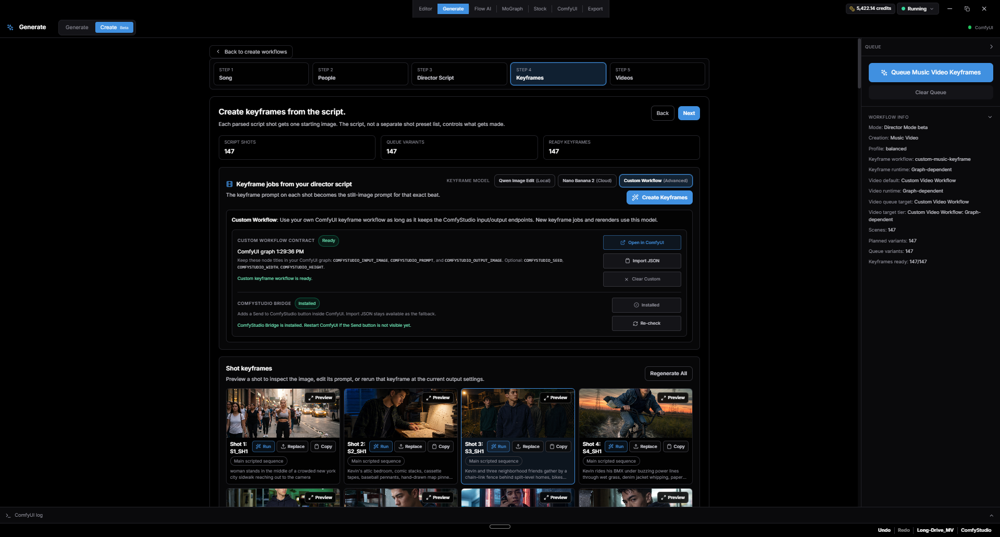
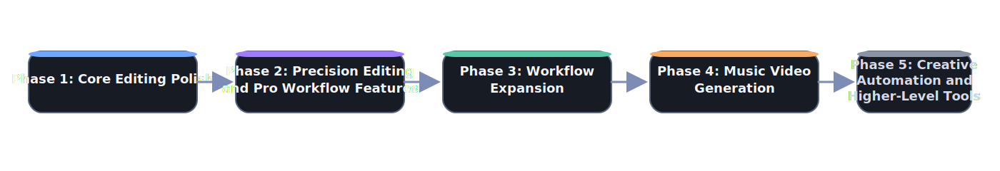

# Velorn

Velorn is an open-source desktop AI video workstation for creators who use ComfyUI. It brings planning, generation, asset management, timeline editing, captions, effects, and export into one project-based app.

Use built-in local and cloud workflows, bring your own ComfyUI API workflow JSON, or install the bundled Velorn Bridge so a graph open in ComfyUI can be sent back into Velorn.

**Website:** [velorn.ai](https://velorn.ai)

**Downloads:** [GitHub Releases](https://github.com/VelornLabs/velorn/releases)

<p align="center">
  
</p>

## What Velorn Is For

- Creating music videos from lyrics, timing, characters, keyframes, video shots, and timeline edits.
- Building UGC-style creator ads and small-business ads with editable shot plans.
- Running curated local and cloud image/video workflows from one Generate workspace.
- Running custom ComfyUI image, video, keyframe, and music-video workflows inside the app.
- Editing generated clips with tracks, transitions, effects, captions, proxy/cache tools, and export.
- Keeping generated media, prompts, workflow outputs, and timelines organized inside a project.

Velorn is not a replacement for ComfyUI. It is the production layer around ComfyUI: plan the work, send jobs to ComfyUI, collect the outputs, and finish the edit.

<p align="center">
  
</p>

## Download

Most users should download the packaged desktop app from the [GitHub Releases page](https://github.com/VelornLabs/velorn/releases).

Release assets include:

- `Windows Installer`
- `Windows Portable`
- `Mac (Apple Silicon)`
- `Mac (Intel)`
- `Linux AppImage`
- `Linux deb`

Ignore GitHub's auto-generated source-code archives unless you plan to build Velorn from source.

## Main Features

### Generate

Generate runs built-in local workflows, cloud/partner workflows, and custom ComfyUI workflows.

- Local image, video, image-edit, audio, and utility workflows.
- Cloud workflows such as Nano Banana 2, GPT Image 2, Seedance, Kling, and other partner-node routes where available.
- Custom Image and Custom Video workflows for users who want Velorn to run their own ComfyUI API graphs.
- API JSON import for advanced users who prefer exporting workflows manually from ComfyUI.
- Velorn Bridge support so compatible graphs can be sent from ComfyUI back to the correct Velorn panel.
- Workflow setup checks for missing nodes, models, credentials, and configuration.
- A Featured / My Workflows / Templates browser with Local and Cloud filters. Imported community workflows appear in Featured next to the built-ins.

<p align="center">
  
</p>

### Create

Create contains guided creator workflows built on Velorn's Director Mode engine.

- **Music Video Creation** - turns a song, lyric timing, characters, references, and a director script into keyframes, video shots, and an editable timeline.
- **UGC Creator** - builds creator-style social ads with hooks, dialogue, product demos, try-ons, testimonials, and editable shot-by-shot outputs.
- **Business Ad Creator** - builds offer-first ads for local businesses, ecommerce products, events, services, and small teams.
- **Short Film Creation** - experimental script-to-scene coverage workflow. This is still very beta and may have rough edges.

### Music Video Creation

The Music Video Creator supports:

- Song import and lyric timing.
- ASR transcription or pasted-lyrics alignment into SRT.
- People/cast setup, including existing character sheets.
- Per-shot keyframe prompts, reference images, prompt copy, prompt editing, image replacement, and shot reruns.
- Built-in keyframe routes such as Qwen Image Edit and Nano Banana 2.
- Custom keyframe workflows using Velorn endpoint nodes.
- Built-in video routes such as LTX 2.3 Music and WAN 2.2.
- Custom video workflows with optional injected keyframe image, prompt, seed, width, height, FPS, duration, and audio.
- Timeline assembly from generated shot assets.

<p align="center">
  
</p>

### Timeline Editor

The editor includes:

- Project asset browser.
- Multi-track video/audio timeline.
- Clip trimming, moving, snapping, overlap replacement behavior, and transitions.
- Text, shape, title, solid-color, adjustment-layer, keyframe, and visual effect tools.
- Inspector controls.
- Proxy/cache tools for smoother playback.
- Export panel for final renders.

### Captions

Captions can be generated from edited timeline audio and styled in-app.

- Timeline-aware transcription.
- Caption style presets.
- Font, color, outline, background, shadow, and animation controls.
- Saved caption style presets for reuse.
- Live preview with play/scrub controls and safe-zone overlays.
- Export-ready caption renders.

### Export

The Export tab includes practical render presets, hardware-accelerated options where available, queue controls, and project-aware output settings.

<p align="center">
  
</p>

### Stock

The Stock tab uses Pexels so you can search and import photos or videos directly into the current project. A Pexels API key is optional and can be added in Settings.

<p align="center">
  
</p>

### ComfyUI Integration

Velorn talks to a local ComfyUI server and can also help launch it.

- Default endpoint: `http://127.0.0.1:8188`
- Custom port support in Settings.
- Windows launcher support for a configured ComfyUI start script.
- macOS launcher support for a configured `ComfyUI.app`.
- Optional auto-start, stop-on-quit, and restart behavior.
- Embedded ComfyUI tab for opening and editing graphs.
- ComfyUI account login support inside the embedded ComfyUI tab.
- ComfyUI credit balance display when available.

Only localhost/loopback ComfyUI endpoints are supported in the desktop app.

### AI Agents (MCP)

Velorn includes a local MCP server with 100+ tools for Codex, Claude Code, Cursor-compatible tools, and other MCP clients.

- Endpoint: `http://127.0.0.1:19790/mcp`
- In-app setup: `Settings > Agents (MCP)` (one copy-paste command per client)
- Guide: [docs/MCP.md](docs/MCP.md)

Agents can inspect the open project, review timeline frames and visible shots, troubleshoot ComfyUI setup, preview safe timeline edits, queue approved generation work, and start delivery exports.

Agents can also bring in community ComfyUI workflows: hand one a workflow link or file, and it analyzes the graph, reports missing custom nodes and models, installs them after your approval, and runs the workflow on your timeline assets.

Write tools preview their plan first and apply only after approval, on Velorn's normal undo stack. MCP is the recommended automation path for agent-assisted review, timeline operations, graphics polish, and generation workflows.

<p align="center">
  
</p>

## Custom Workflows

Custom workflows are one of the main reasons Velorn exists.

Advanced users can:

1. Open a starter graph from Velorn.
2. Modify it in ComfyUI.
3. Keep the required Velorn endpoint nodes.
4. Send it back with the Velorn Bridge or import the API workflow JSON manually.
5. Run that graph from Velorn as part of a creator flow or from Generate.

Common Velorn endpoint node titles include:

- Velorn input image - `VELORN_INPUT_IMAGE`
- Velorn prompt - `VELORN_PROMPT`
- Velorn seed - `VELORN_SEED`
- Velorn width - `VELORN_WIDTH`
- Velorn height - `VELORN_HEIGHT`
- Velorn FPS - `VELORN_FPS`
- Velorn duration - `VELORN_DURATION`
- Velorn audio - `VELORN_AUDIO`
- Velorn output image - `VELORN_OUTPUT_IMAGE`
- Velorn output video - `VELORN_OUTPUT_VIDEO`

Exact `VELORN_*` titles are preferred, but Velorn also recognizes readable titles such as `Velorn input image`. Older graphs that still use `COMFYSTUDIO_*` marker titles are supported for backward compatibility.

If an endpoint is present, Velorn can inject that value. If an endpoint is not present, the graph controls that setting itself.

<p align="center">
  
</p>

## Requirements

Minimum for normal app use:

- A separately installed local ComfyUI.
- Enough disk space for generated media and project assets.

Optional integrations:

- Comfy account login or API key for paid partner-node workflows.
- Pexels API key for the Stock tab.
- LM Studio for the local LLM Assistant.

Local workflow requirements vary by model. Some workflows can run on modest GPUs, while heavy video workflows may need 24 GB+ VRAM. Cloud workflows shift most of that requirement to the provider but may require credits.

## First Run

1. Install and launch Velorn.
2. Choose a projects folder.
3. Create or open a project.
4. Configure ComfyUI in `Settings > ComfyUI Connection`.
5. Use `Velorn > Getting Started` from the bottom menu if you want the guided setup path.

If ComfyUI is running on a non-default port, update the endpoint in Settings and run the connection test.

## ComfyUI Setup Notes

Velorn ships workflow JSON files, but workflows still need the correct ComfyUI environment.

Depending on the workflow, users may need:

- Custom nodes installed in ComfyUI.
- Model files in the expected folders.
- Cloud/partner credentials.
- CORS enabled for the local ComfyUI endpoint.
- Enough local VRAM for the selected model and resolution.

Inside Generate, use the workflow setup and dependency tools when something is missing.

## Run From Source

For development, run the Electron app:

```bash
npm install
npm run electron:dev
```

Browser-only `npm run dev` is useful for frontend work, but Electron is the normal development path because many features depend on desktop APIs.

## Build Commands

```bash
npm run build
npm run electron:build:win
npm run electron:build:mac
npm run electron:build:linux
```

Packaged artifacts are written to `release/`.

For release process details, see:

- `docs/RELEASE_PROCESS.md`
- `docs/CI_SECRETS.md`
- `docs/AI_RELEASE_HANDOFF.md`

## Roadmap

See [ROADMAP.md](ROADMAP.md).

<p align="center">
  <a href="ROADMAP.md">
    
  </a>
</p>

## Contributing

Velorn is open source, and contributions are welcome.

See:

- `CONTRIBUTING.md`
- `CODE_OF_CONDUCT.md`
- `SECURITY.md`

## License

Velorn is licensed under the GNU General Public License v3.0. See `LICENSE`.

Versions released before this license change remain available under the license terms they were released with.
