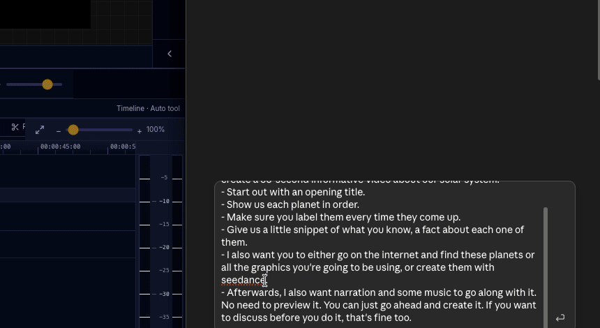
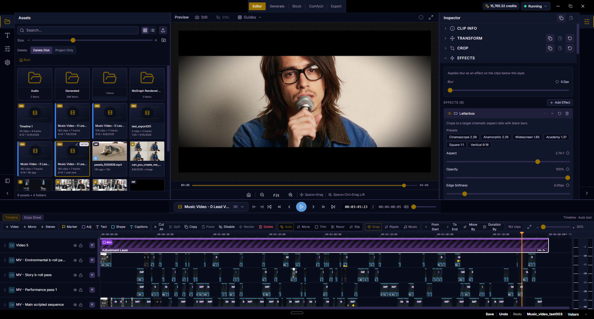
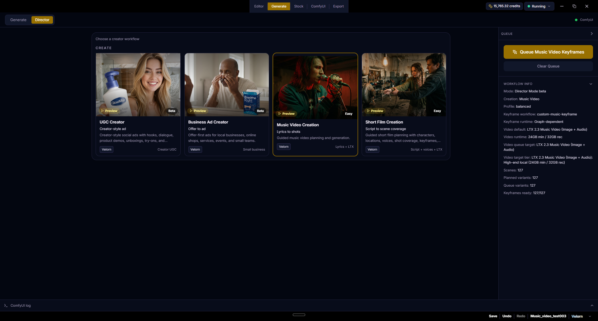
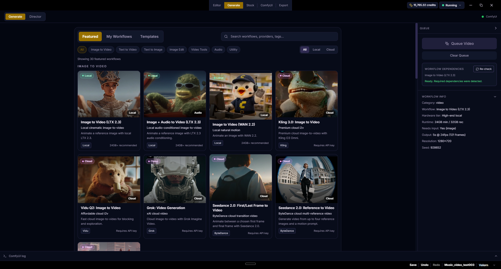
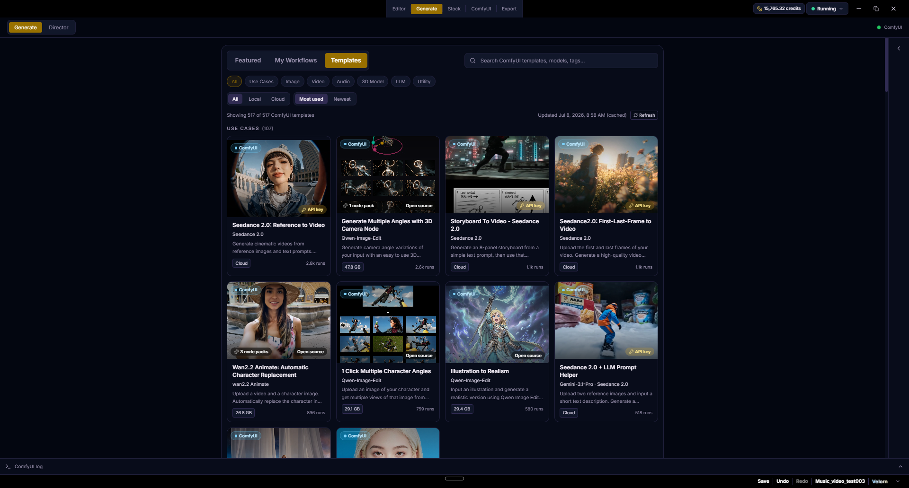
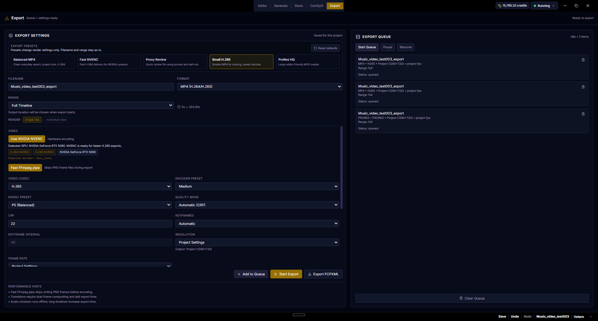
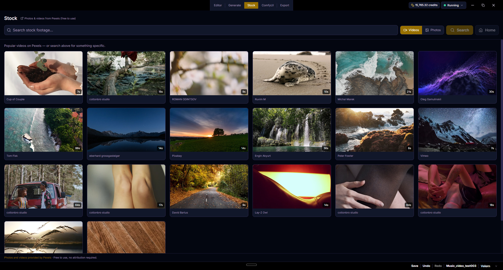
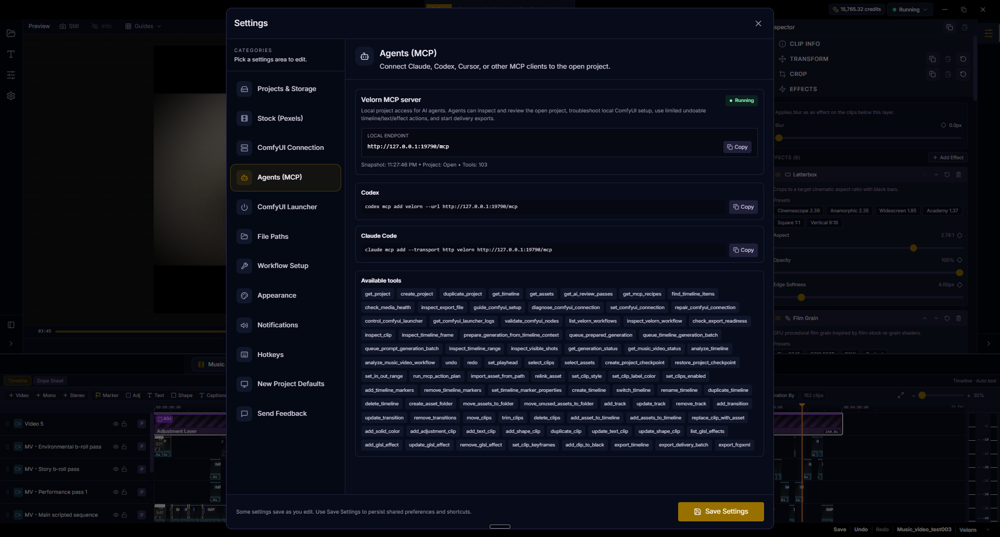
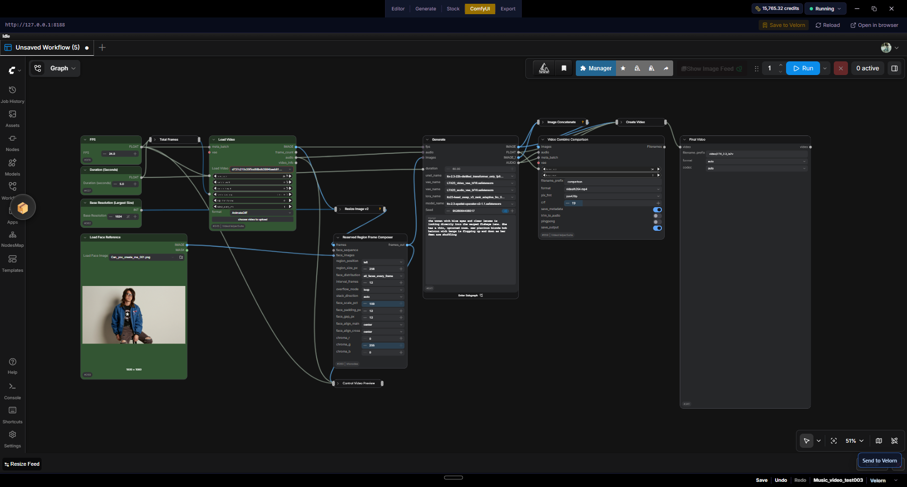

# Velorn

**开源 AI 视频工作站 —— 为你准备的真正的剪辑器，为你的智能体准备的 100 多个 MCP 工具。**

[English](../../README.md) · [Español](README.es.md) · 简体中文 · [日本語](README.ja.md) · [한국어](README.ko.md) · [Português (Brasil)](README.pt-BR.md) · [Français](README.fr.md)

<i>一句提示词。智能体生成素材、搭建时间线并混音 — 全程实时，通过 MCP 完成。</i>

> 本翻译尽力保持更新。如有不清楚之处，请以[英文版 README](../../README.md) 为准。欢迎提交 PR 改进翻译！

Velorn 是一款面向 ComfyUI 用户的开源桌面 AI 视频工作站。它将策划、生成、素材管理、时间线剪辑、字幕、特效和导出整合到一个以项目为单位的应用中。

你可以使用内置的本地和云端工作流，导入自己的 ComfyUI API 工作流 JSON，或安装随附的 Velorn Bridge，让在 ComfyUI 中打开的图直接发送回 Velorn。

  

## Velorn 的用途

- 基于歌词、时间对齐、角色、关键帧、视频镜头和时间线剪辑制作音乐视频（MV）。
- 制作 UGC 风格的创作者广告和小型企业广告，镜头方案可编辑。
- 在统一的 Generate 工作区中运行精选的本地和云端图像/视频工作流。
- 在应用内运行自定义的 ComfyUI 图像、视频、关键帧和音乐视频工作流。
- 使用轨道、转场、特效、字幕、代理/缓存工具和导出功能剪辑生成的片段。
- 在项目中统一管理生成的媒体、提示词、工作流输出和时间线。

Velorn 不是 ComfyUI 的替代品。它是 ComfyUI 之上的制作层：规划工作、把任务发送给 ComfyUI、收集输出，并完成最终剪辑。

  

## 下载

大多数用户应从 [GitHub Releases 页面](https://github.com/VelornLabs/velorn/releases)下载打包好的桌面应用。

每个 Release 包含以下文件：

- `Windows Installer`（Windows 安装包）
- `Windows Portable`（Windows 便携版）
- `Mac (Apple Silicon)`（Apple 芯片 Mac）
- `Mac (Intel)`（Intel 芯片 Mac）
- `Linux AppImage`
- `Linux deb`

除非你打算从源码构建 Velorn，否则请忽略 GitHub 自动生成的源码压缩包。

## 主要功能

### Generate（生成）

Generate 可运行内置本地工作流、云端/合作伙伴工作流以及自定义 ComfyUI 工作流。

- 本地图像、视频、图像编辑、音频和实用工具工作流。
- 云端工作流，如 Nano Banana 2、GPT Image 2、Seedance、Kling 以及其他可用的合作伙伴节点线路。
- Custom Image 和 Custom Video 工作流，供希望用 Velorn 运行自己 ComfyUI API 图的用户使用。
- API JSON 导入，供偏好从 ComfyUI 手动导出工作流的高级用户使用。
- Velorn Bridge 支持：兼容的图可以从 ComfyUI 发送到 Velorn 的对应面板。
- 工作流环境检查：检测缺失的节点、模型、凭据和配置。
- Featured / My Workflows / Templates 浏览器，带 Local 和 Cloud 筛选。导入的社区工作流会出现在 Featured 中，与内置工作流并列。

  

Templates 标签页可浏览官方 ComfyUI 模板目录（500 多个模板，含大小和热度信息），并将任意模板在内嵌的 ComfyUI 标签页中打开。

  

### Create（创作）

Create 包含基于 Velorn Director Mode 引擎构建的引导式创作工作流。

- **Music Video Creation** - 将歌曲、歌词时间轴、角色、参考图和导演脚本转化为关键帧、视频镜头和可编辑的时间线。
- **UGC Creator** - 制作创作者风格的社交广告，包含开场钩子、对白、产品演示、试穿、用户见证，以及可逐镜头编辑的输出。
- **Business Ad Creator** - 为本地商家、电商产品、活动、服务和小团队制作以优惠为核心的广告。
- **Short Film Creation** - 实验性的剧本到场景覆盖工作流。仍处于早期测试阶段，可能有不完善之处。

### Music Video Creation（音乐视频创作）

音乐视频创作器支持：

- 歌曲导入和歌词时间对齐。
- ASR 转写，或将粘贴的歌词对齐为 SRT。
- 人物/角色设置，包括已有的角色设定表。
- 逐镜头关键帧提示词、参考图、提示词复制与编辑、图像替换和镜头重跑。
- 内置关键帧线路，如 Qwen Image Edit 和 Nano Banana 2。
- 使用 Velorn 端点节点的自定义关键帧工作流。
- 内置视频线路，如 LTX 2.3 Music 和 WAN 2.2。
- 自定义视频工作流，可选注入关键帧图像、提示词、种子、宽度、高度、FPS、时长和音频。
- 将生成的镜头素材自动组装到时间线。

### 时间线编辑器

编辑器包括：

- 项目素材浏览器。
- 多轨视频/音频时间线。
- 片段裁剪、移动、吸附、重叠替换行为和转场。
- 文字、形状、标题、纯色、调整图层、关键帧和视觉特效工具。
- 检查器（Inspector）控制。
- 代理/缓存工具，让播放更流畅。
- 用于最终渲染的导出面板。

### 字幕

字幕可以从剪辑后的时间线音频生成，并在应用内设置样式。

- 感知时间线的转写。
- 字幕样式预设。
- 字体、颜色、描边、背景、阴影和动画控制。
- 可保存的字幕样式预设，方便复用。
- 带播放/拖动控制和安全区叠加的实时预览。
- 可直接导出的字幕渲染。

### 导出

Export 标签页包含实用的渲染预设、可用时的硬件加速选项、队列控制和感知项目的输出设置。

  

### Stock（素材库）

Stock 标签页使用 Pexels，让你可以直接搜索照片或视频并导入到当前项目。Pexels API 密钥为可选项，可在 Settings 中添加。

  

### ComfyUI 集成

Velorn 与本地 ComfyUI 服务器通信，也可以帮助启动它。

- 默认端点：`http://127.0.0.1:8188`
- 在 Settings 中支持自定义端口。
- Windows 启动器支持：可配置 ComfyUI 启动脚本。
- macOS 启动器支持：可配置 `ComfyUI.app`。
- 可选的自动启动、退出时停止和重启行为。
- 内嵌 ComfyUI 标签页，可打开和编辑图。
- 在内嵌 ComfyUI 标签页中支持 ComfyUI 账号登录。
- 可用时显示 ComfyUI 积分余额。

桌面应用仅支持 localhost/回环地址的 ComfyUI 端点。

### AI 智能体（MCP）

Velorn 内置本地 MCP 服务器，提供 100 多个工具，支持 Codex、Claude Code、兼容 Cursor 的工具及其他 MCP 客户端。

- 端点：`http://127.0.0.1:19790/mcp`
- 应用内设置：`Settings > Agents (MCP)`（每个客户端一条复制粘贴命令）
- 指南：[docs/MCP.md](../MCP.md)

智能体可以检查当前打开的项目、审阅时间线画面和可见镜头、诊断 ComfyUI 配置问题、预览安全的时间线编辑、将批准后的生成任务加入队列，以及启动成片导出。

智能体还可以引入社区的 ComfyUI 工作流：把工作流链接或文件交给它，它会分析该图、报告缺失的自定义节点和模型、在你批准后安装它们，并用你时间线上的素材运行该工作流。

写入类工具会先预览执行计划，经批准后才应用，且全部走 Velorn 的常规撤销栈。MCP 是智能体辅助审阅、时间线操作、图形润色和生成工作流的推荐自动化途径。

  

## 自定义工作流

自定义工作流是 Velorn 存在的主要原因之一。

高级用户可以：

1. 从 Velorn 打开一个起始图。
2. 在 ComfyUI 中修改它。
3. 保留所需的 Velorn 端点节点。
4. 用 Velorn Bridge 发送回来，或手动导入 API 工作流 JSON。
5. 在 Velorn 中将该图作为创作流程的一部分或从 Generate 运行。

常用的 Velorn 端点节点标题包括：

- Velorn input image - `VELORN_INPUT_IMAGE`
- Velorn prompt - `VELORN_PROMPT`
- Velorn seed - `VELORN_SEED`
- Velorn width - `VELORN_WIDTH`
- Velorn height - `VELORN_HEIGHT`
- Velorn FPS - `VELORN_FPS`
- Velorn duration - `VELORN_DURATION`
- Velorn audio - `VELORN_AUDIO`
- Velorn output image - `VELORN_OUTPUT_IMAGE`
- Velorn output video - `VELORN_OUTPUT_VIDEO`

推荐使用精确的 `VELORN_*` 标题，但 Velorn 也能识别诸如 `Velorn input image` 这样的可读标题。仍在使用 `COMFYSTUDIO_*` 标记标题的旧图出于向后兼容依然受支持。

如果某个端点存在，Velorn 就可以注入对应的值；如果不存在，则由图自行控制该设置。

  

